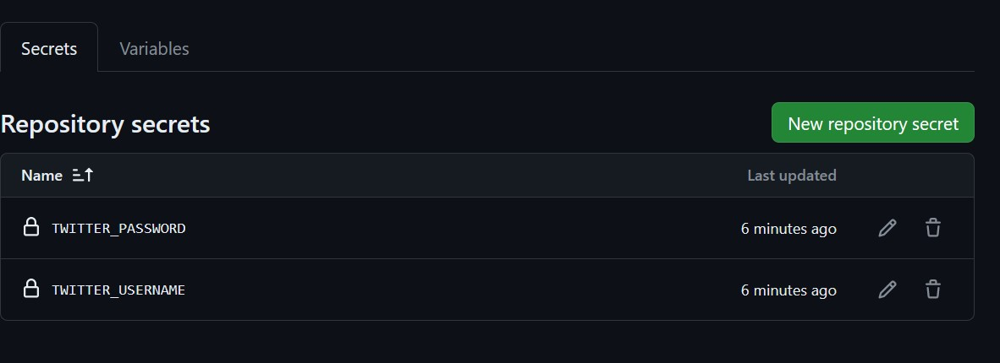
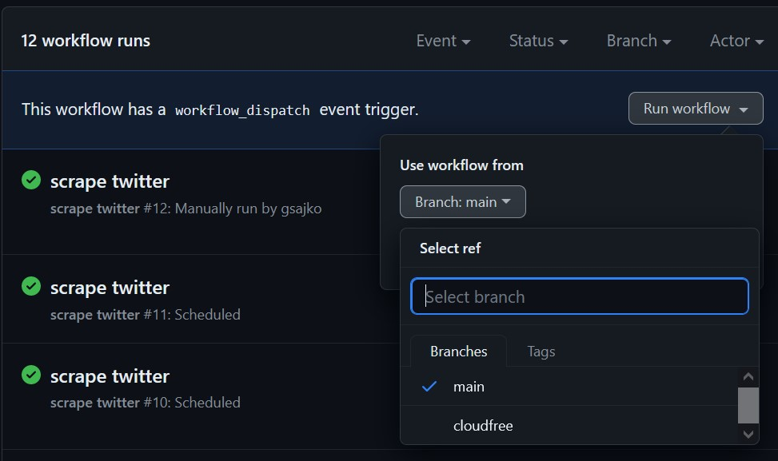
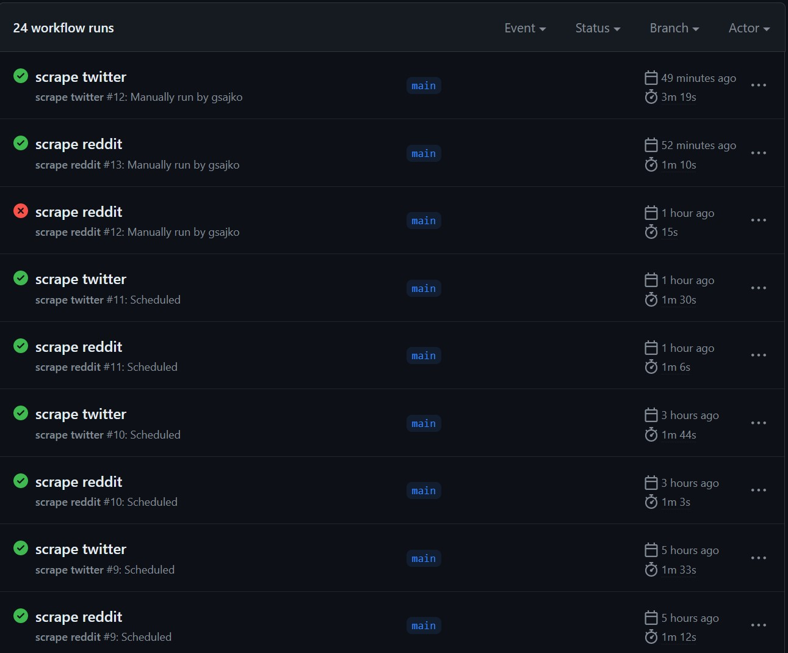
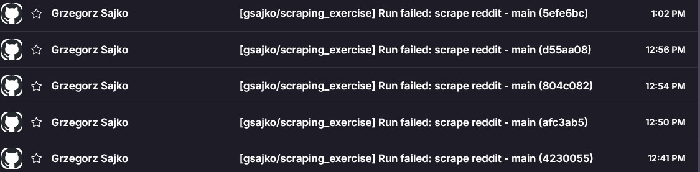

# scraping_exercise

# Intro
For scraping Twitter and Reddit, I used `tweepy`(Twitter) and `beautifulsoup4`(Reddit) libraries.

Twitter is definetly more complicated to scrape, because of the need to sign in, and the fact that Twitter has a lot of dynamic content.

For Reddit I leverage the fact, that Reddit allows `old.reddit.com` to be scraped, and it's much easier to scrape (and more robust).

# Setup
To deploy this scraper you need to fork this repository.

### Twitter Credentials:
You need to have a Twitter account and provide your credentials to the scraper.

❗️❗️To scrape Twitter you need session file, it can be created by running `twitter_sign_in.py` **locally**❗️❗️

Or for example https://github.dev/. 

I use `poetry` for dependency management, so you need to install it first.
After that, run `poetry shell` and `poetry install` to install all dependencies.
Then run `poetry run python twitter_sign_in.py` and follow the instructions.

### GitHub Actions:

#### Add Twitter Credentials 
Then navigate to your repository on GitHub, click on "Settings", then "Secrets", and finally "Actions". Click on "New repository secret" to add a new secret. Provide a name for your secret (`TWITTER_USERNAME` and `TWITTER_PASSWORD`) and the corresponding values, then click "Add secret".

#### Enable Write Access    
You need to enable write access to the repository.
Go to your repository on GitHub, click on "Settings", then "Actions", "General" and at "Workflow permissions" enable "Read and write permissions".



### Firestore Setup:
Notice:
There is `cloudfree` branch, that generates scrapes and saves them to `json` files, without using Cloud Database.

#### GCloud Setup:
You need to have Google Cloud account.
1. Create a Google Cloud Project
- Go to the Google Cloud Console.
- Click the project drop-down and select or create the project for which you want to add an API key.
- Click the hamburger menu in the top left corner and select "APIs & Services" > "Dashboard".
- Click "Create Project" if you're starting from scratch, or select an existing project if you already have one.
2. Enable Firestore API
- In the Google Cloud Console, go to the "APIs & Services" > "Library" section.
- Search for "Cloud Firestore API" and click on it.
- Click "Enable" to enable the Firestore API for your project.
3. Create a Firestore Database
- In the Google Cloud Console, go to the "Firestore Database" section.
- Click "Create database".
- Choose "Start in production mode".
- Select a Cloud Firestore location for your database.
- Click "Create".

#### Add GCloud Key to GitHub Secrets:
Add the service account key to your Github Actions secrets  

1. Create a Service Account:
- Go to the Google Cloud Console.
- Select your project.
- Navigate to "IAM & Admin" > "Service accounts".
- Click "Create Service Account".
- Enter a name for the service account, select a role (e.g., "Cloud Datastore User" for Firestore), and click "Create".
- Click "Done" to finish creating the service account.
2. Download the Service Account Key:
- In the list of service accounts, find the one you just created.
- Click on the three dots under "Actions" and select "Manage keys".
- Click "Add Key" and choose "JSON".
- The key file will be downloaded to your computer. Keep this file secure and do not share it publicly.
3. Add the JSON Key to GitHub Secrets:
- Go to your GitHub repository.
- Click on "Settings" > "Secrets" > "New repository secret".
- Enter a name for the secret (`GOOGLE_CREDENTIALS`).
- Paste the JSON key into the "Value" field.
- Click "Add secret".

### Scrape Manual Trigger:
To trigger the scraper manually, go to the "Actions" tab in your repository, click on "Scrape" and then "Run workflow".
Just don't run two scrapers at the same time, it will cause a conflict.

# Usage
Changes to the scraper configuration can be made in respective `.yml` files in the `.github/workflows` directory.


### Reddit config
You should edit this part (and commit).
```yaml
env:
    SUBREDDIT: 'wallstreetbets'
    NUM_PAGES: 3
    # The number of pages to scrape from the subreddit. Each page contains 25 posts. 
    # Defaults to 3, resulting in 75 posts (before filtering).
    MIN_NR_COMMENTS: 10
    # The minimum number of comments a post must have to be included.
```
This config will scrape 75 (3x25) posts from `wallstreetbets` subreddit, filter out posts with less than 10 comments and save the **30 most recent ones**.

The last part (how many posts to save) can be made configurable too, but for sake of simplicity I left it out of config.

### Twitter config
You should edit this part (and commit).

```yaml
env:
    # ----------------------------------------------
    HANDLE: "elonmusk"
    # The Twitter user handle to scrape tweets from.
    # ----------------------------------------------
    HASHTAG: "BTC"
    # The hashtag to search for
    MIN_FAVES: 300
    # The minimum number of likes a tweet must have to be considered
    PAGES: 50
    # The number of pages to scrape
    # More pages will result in more tweets, but it can be Rate Limited.
```

This config will scrape 2 pages of `elonmusk` tweets, and save the **15 most recent ones**.

It will also search for `BTC` hashtag (don't put # in front of it), in search parameters will specify to search for tweets with at least 300 likes (it doesn't work correctly, but it removes low engagement tweets).
Out of all collected tweets, it will save the **3 most liked ones**.


To test it out without Firebase, you can use `cloudfree` branch, when triggering the scraper.



# Why use Github Actions over other Cloud Services?
- It's easier to set up
- It's free (for small traffic)
- It's Cloud agnostic (I can easly switch to another cloud NoSQL database)

### It's integrated with GitHub
 - I get a nice overview of all my scrapes
 

- I get e-mail notifications for failed scrapes


- I can easily trigger the scraper manually 
- I can view scrapes on mobile GitHub app
- GitHub is well ... GitHub: Because each scrape is committed to the repository, it creates a nice history of all scrapes - if the database gets corrupted, I can always go back to the commit and see the scrape.
I could even get the data from each scrape ever commited.
- each version also has a coresponing `.yaml` file version, so I can see what was the configuration at the time of the scrape.

    